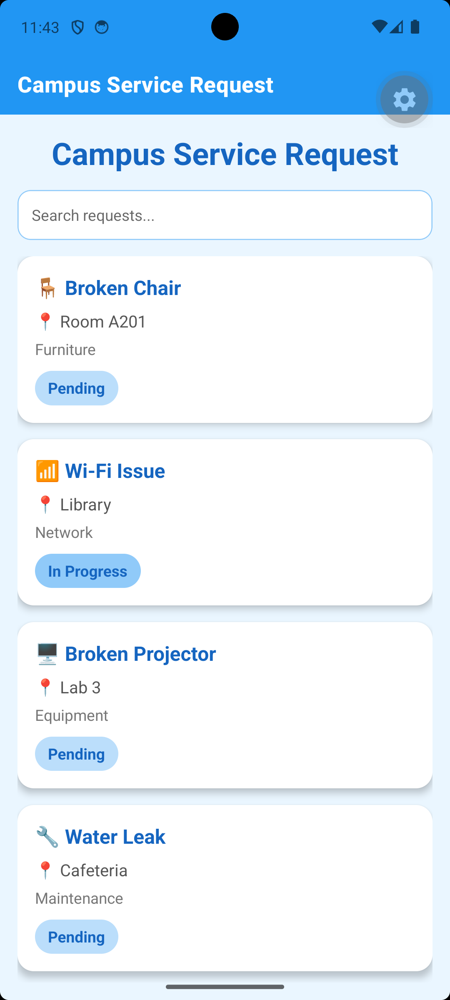
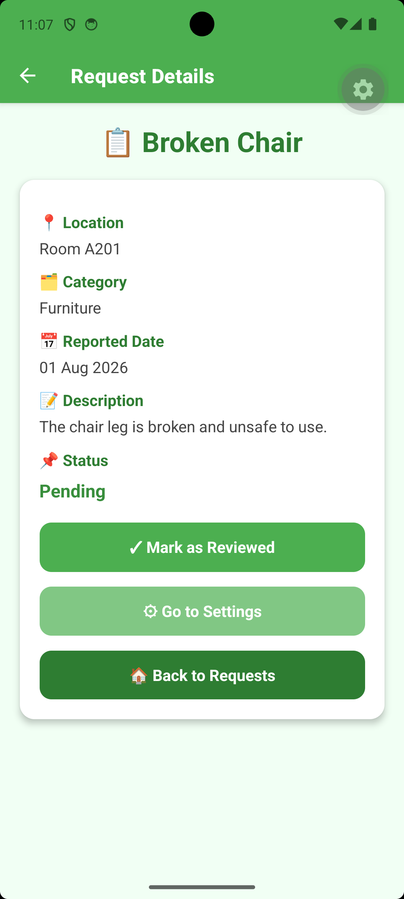
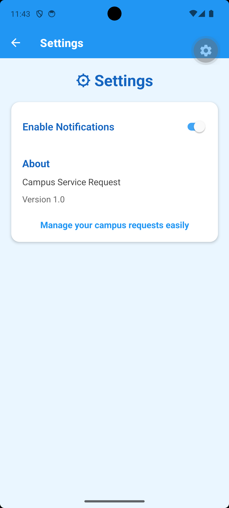

Campus Service Request

Student Details - 

- Name: Sashritha Singh 
- Student ID: 80001393  

Target Domain - 

Campus Management

Problem Statement - 

Students often face problems on campus such as broken equipment, Wi-Fi issues, and maintenance problems. There is no simple way to report and track these issues other than meeting the administration.

App Solution - 

Campus Service Request is a mobile application that allows students to view campus issues, check details and manage request statuses.

Features - 

- View service requests
- Search requests
- View request details
- Mark requests as reviewed
- Settings screen

Technologies Used - 

- React Native
- Expo
- TypeScript

Screenshots - 

1. Home Screen

2. Detail Screen

3. Settings Screen

